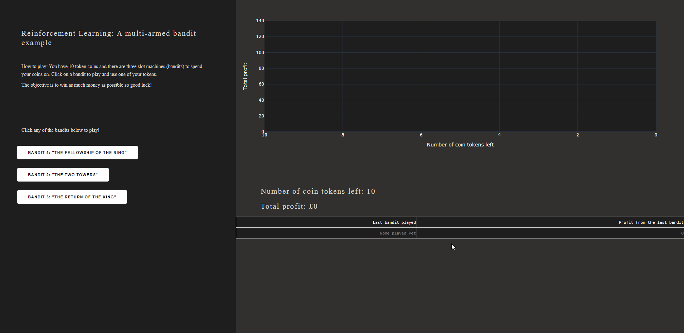

# What is the purpose of this app?
I created this app in order to illustrate the exploration-exploitation trade-off, one of the most important concepts in Reinforcement Learning. 

# How do we run it?
There are two ways to run the app:
1) Simply download or fork the repo, install the packages in the requirements.txt file using the command `pip install -r requirements.txt` and then run it using the command
`python multi_armed_bandit_example.py`
2) You can use Docker to run it as well! Assuming that you already have Docker installed, run the following commands:
    -  docker build -t multi-armed-bandit-example .
    - docker run -p 8050:8050 multi-armed-bandit-example

The app will give you a [local url](http://localhost:8050) that you can copy paste on your favourite browser to play the game. Enjoy!

# How does it look like?
Here's a Demo: 

# What is the tech stack of the App?
Python 3 and Dash. Oh, and a little bit of CSS!

# What do we learn from this?
The user has no info about the three bandits. Thus, they would need to sufficiently explore before exploiting what they think is the best policy. After they finish the first round they need to 
- Write down their score
- Write down the strategy they followed
- Refresh the webpage and play again

After the second time they need to 

- Write down the score
- Write down their strategy
- If the strategy is different, why did they change? 
- If the strategy is the same, what validated their thinking?
- Did they do better or worse in the second time.

Different users have different strategies. Some explore more, some are more conservative with what they think is a "safe bet" etc. Thus, this demonstrates some key characteristics that our reinforcement learning algorithms need to have as well as problems they need to tackle.